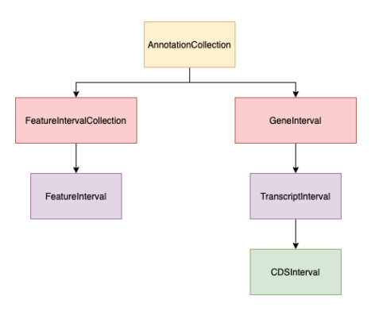

BioCantor Annotation Data Structures
====================================

The above object paradigm is used to construct a hierarchical set of objects that encapsulate common genomic
concepts, and associated interval arithmetic operations.

The core data structure is :class:`biocantor.gene.feature.AbstractFeatureInterval`, which has two child classes:

1. :class:`biocantor.gene.transcript.TranscriptInterval`.
2. :class:`biocantor.gene.feature.FeatureInterval`.

:class:`biocantor.gene.transcript.TranscriptInterval` are used to model *transcribed features*. They can be coding or non-coding.
In contrast, :class:`biocantor.gene.feature.FeatureInterval` are intended to be generic intervals, which may be transcribed or non-transcribed.
Both of these intervals implement a variety of methods that allow for operations such as:

1. Coordinate translations between genomic, CDS and transcript coordinate systems. These operations can be performed as either points or as intervals.
2. Sequence extraction in all possible coordinate systems.
3. Export to GFF3, BED and JSON.

Additionally, accessory modules exist to export groups of intervals to GenBank and NCBI TBL format, as well as helper
functions to easily produce GFF3 with embedded FASTA.

Both transcripts and features have **container classes**, called :class:`biocantor.gene.collections.GeneInterval`
and :class:`biocantor.gene.collections.FeatureIntervalCollection` respectively. These classes contain one or more
of their constituent types, and provide methods for iterating over the members.

The final core data model is :class:`biocantor.gene.collections.AnnotationCollection`. This object contains one or more
:class:`~biocantor.gene.collections.GeneInterval` and :class:`~biocantor.gene.collections.FeatureIntervalCollection`.
This is intended to model an arbitrary genomic interval *on a single sequence/chromosome*. This object contains
methods that allow a user to subquery the interval by position or by identifiers of constituent objects. This object
is produced when parsing annotation file formats.

Interval Hierarchies
--------------------

All interval types in BioCantor can be arbitrarily joined ("spliced"), including overlapping intervals and 0-bp gaps,
except for :class:`biocantor.gene.collections.AnnotationCollection`, which are always unjoined intervals representing
the bounds of their constituents, the bounds of the sequence they derived from, or the bounds of their subquery,
depending on the source of the object.

Genes
~~~~~

BioCantor models the concept of *genes* as a three layer hierarchy:

.. code-block::

    GeneInterval -> TranscriptInterval -> CDSInterval (optional)

Under this model, a gene can be considered to be any sort of transcribed interval. This is different from the
Sequence Ontology model, where transcribed intervals as well as non-transcribed intervals are direct children
of the `biological_region` term. This model is a simplification that can have issues -- for example, pseudogenes
that are not transcribed.

All :class:`biocantor.gene.transcript.TranscriptInterval` and :class:`biocantor.gene.collections.GeneInterval`
objects have an optional :class:`biocantor.gene.biotype.Biotype` associated that assigns a INSDC-style Biotype
to the interval. :class:`~biocantor.gene.transcript.TranscriptInterval` objects do not have to have the same biotype
as their parent gene. This follows the GENCODE/Ensembl model for biotype assignment, rather than the NCBI model.

Non-transcribed intervals (Features)
~~~~~~~~~~~~~~~~~~~~~~~~~~~~~~~~~~~~

BioCantor models the concept of generic intervals as a two layer hierarchy:

.. code-block::

    FeatureIntervalCollection -> FeatureInterval

This is intended to allow for grouping of non-transcribed features. An example of this could be a promoter region,
with multple known transcription factor binding sites. In this example, the promoter could be built as a
:class:`~biocantor.gene.collections.FeatureIntervalCollection`, with a child
:class:`~biocantor.gene.feature.FeatureInterval` for each TFBS.

While both of these objects do allow for joined/compound intervals, doing so is of course optional and not as likely
to make sense for many use cases.

Unlike genes, :class:`~biocantor.gene.feature.FeatureInterval` do not have a restricted ontology of types. Additionally,
they can have multiple types, stored as the value `feature_types`. When a
:class:`~biocantor.gene.collections.FeatureIntervalCollection` is constructed, it adopts the union of all types
of its children :class:`~biocantor.gene.feature.FeatureInterval`. This allows for set operations to occur - as in
the above example, there could be three intervals with types ``["tfA", "tfB", "tfC"]`` respectively, and thus the
collection containing them will have all three of those types associated with it.
:class:`~biocantor.gene.collections.FeatureIntervalCollection` also can have one type of its own, which in the above
example could be ``promoter``.
