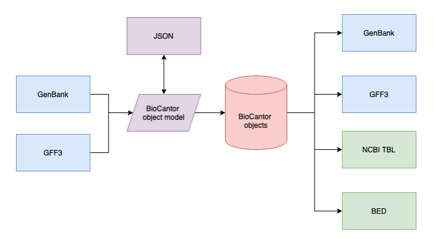

Annotation Object Model
=======================

The core BioCantor annotation object is the :class:`biocantor.gene.collections.AnnotationCollection`. This object can be generated using the included GFF3 or GenBank parser, or from JSON/dictionary representations.

Both parser modules produce a :class:`biocantor.io.models.AnnotationCollectionModel`, which is a https://pypi.org/project/marshmallow-dataclass/ dataclass that can be used to pass around annotation information in a file-format independent manner.

:class:`biocantor.gene.collections.AnnotationCollection` objects can also be exported in standard file formats, including GenBank, GFF3, BED and NCBI .tbl format (for submission to GenBank).
